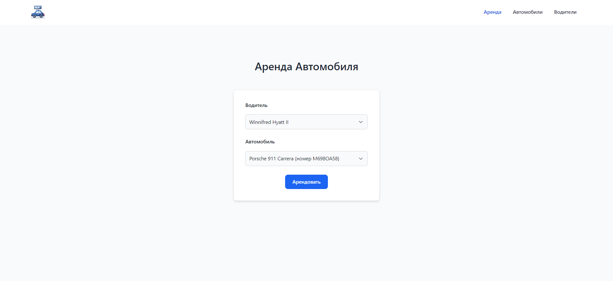

# Rent car

Задание:

Даны два списка. Список автомобилей и список пользователей.
C помощью laravel сделать api для управления списком использования автомобилей пользователями.
В один момент времени 1 пользователь может управлять только одним автомобилем. В один момент времени 1 автомобилем может управлять только 1 пользователь.



Команды для старта (docker):


```angular2html
docker-compose up -d --build
```

```angular2html
docker exec -i rent-car-php-fpm composer i
```

```angular2html
docker exec -i rent-car-php-fpm php artisan migrate
```

```angular2html
docker exec -i rent-car-php-fpm php artisan db:seed
```

```angular2html
docker exec -i rent-car-php-fpm npm i
```

```angular2html
docker exec -i rent-car-php-fpm npm run dev
```

Тесты:
```angular2html
docker exec -i rent-car-php-fpm php artisan test
```

Команды для старта (без docker):


```angular2html
composer i
```

```angular2html
php artisan migrate
```

```angular2html
php artisan db:seed
```

```angular2html
npm i
```

```angular2html
npm run dev
```


Тесты:
```angular2html
php artisan test
```
